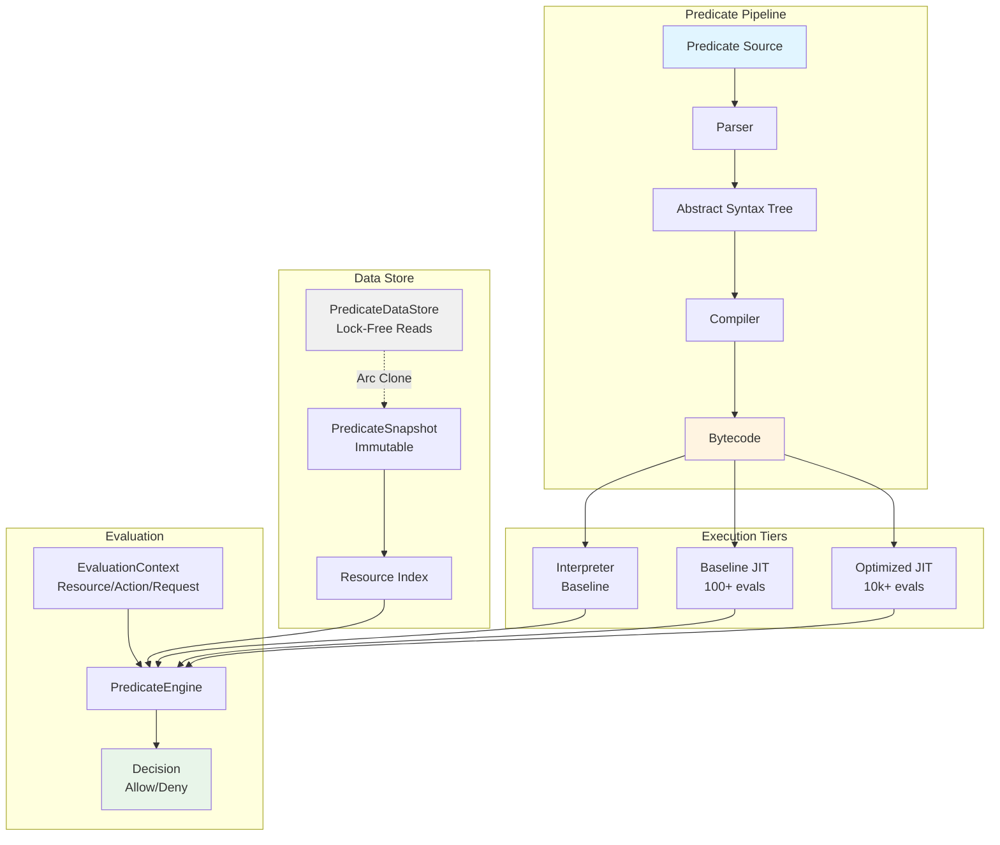

# Idempotent Predicate Engine (IPE)

**A high-performance, AI-native predicate engine built in Rust**

[](https://github.com/jrepp/ipe/actions)
[](https://github.com/jrepp/ipe)
[](https://github.com/jrepp/ipe/actions/workflows/ci.yml)
[](https://codecov.io/gh/jrepp/ipe)
[](https://deps.rs/repo/github/jrepp/ipe)
[](LICENSE)

## What is IPE?

IPE (Idempotent Predicate Engine) is a predicate evaluation engine that compiles human-readable predicates into optimized bytecode. Predicates define access control, workflow validation, and business logic that changes frequently.

### Key Capabilities

- **Declarative Predicate Language**: Write rules that describe intent, not imperative code
- **Bytecode Compilation**: Predicates compile to a compact bytecode representation
- **Lock-Free Reads**: Atomic snapshots enable concurrent predicate evaluation without blocking
- **Zero-Downtime Updates**: Swap predicate sets atomically while serving requests
- **Embedded**: Small binary footprint for integration into existing systems

### Use Cases

- Access control: "production deployments require 2 senior engineer approvals"
- Workflow validation: "tickets must have priority assigned before closing"
- Rate limiting: "API calls limited to 1000/hour per tier"
- Dynamic configuration: Change rules without redeploying services

---

## Architecture



IPE uses a multi-tier execution model:

1. **Parse**: Predicate source → AST
2. **Compile**: AST → Bytecode
3. **Interpret**: Bytecode execution (baseline performance)
4. **JIT** (optional): Hot predicates compile to native code
5. **Store**: Atomic snapshots for lock-free reads

## Features

### Performance
- Bytecode interpretation for fast baseline execution
- Optional JIT compilation via Cranelift for hot paths
- Adaptive tiering automatically optimizes frequently-evaluated predicates
- Lock-free reads using atomic snapshots
- Memory-mapped predicate storage

### Developer Experience
- Natural language intent strings for documentation
- SQL/Go-like syntax for familiarity
- Comprehensive error messages with source locations
- Git-friendly text format

### Embeddable
- Rust library with C FFI
- Python bindings (planned)
- Node.js bindings (planned)
- WebAssembly support (planned)

## Quick Start

### Example Predicate

```rust
predicate RequireApproval:
  "Production deployments need 2+ approvals from senior engineers"

  triggers when
    resource.type == "Deployment"
    and environment in ["production", "staging"]
    and resource.risk_level >= "medium"

  requires
    approvals.count >= 2
    where approver.role == "senior-engineer"
    and approver.department != requester.department
```

### Rust Usage

```rust
use ipe_core::{PredicateEngine, EvaluationContext};

// Load compiled predicates
let engine = PredicateEngine::from_file("predicates.ipe")?;

// Create evaluation context
let ctx = EvaluationContext {
    resource: /* ... */,
    action: /* ... */,
    request: /* ... */,
};

// Evaluate (with automatic JIT optimization)
let decision = engine.evaluate(&ctx)?;

if decision.kind == DecisionKind::Allow {
    // Proceed with action
}
```

### Running Examples

```bash
# Run basic tests
cargo test --lib --package ipe-core

# Run with JIT features (requires Cranelift)
cargo test --all-features

# Build release
cargo build --release
```

## Architecture

```
┌──────────────┐
│ Source (.ipe)│  Natural language + structured logic
└──────┬───────┘
       │ Compile
┌──────▼────────┐
│ Bytecode      │  Compact representation (~200 bytes/predicate)
└──────┬────────┘
       │ Evaluate
┌──────▼────────┐
│ Interpreter   │  ~50μs per predicate
└──────┬────────┘
       │ Profile (100+ evals)
┌──────▼────────┐
│ JIT (Cranelift│  ~10μs per predicate (5-10x faster)
└───────────────┘
```

### Tiered Execution

IPE uses adaptive tiering to automatically optimize frequently-used predicates:

| Tier | Trigger | Compilation | Notes |
|------|---------|-------------|-------|
| Interpreter | Default | Pre-compiled bytecode | Baseline performance |
| Baseline JIT | 100+ evaluations | Fast compilation | Performance boost |
| Optimized JIT | 10k+ evaluations | Full optimization | Maximum speed |

Performance metrics will be added after comprehensive benchmarking with profile-guided optimization.

## Documentation

**📚 [Documentation Index](docs/INDEX.md)** - Start here for guided navigation

### Quick Links

- **[QUICKSTART](QUICKSTART.md)** - Get running in 5 minutes
- **[SUMMARY](SUMMARY.md)** - Executive summary and vision
- **[END_TO_END_EXAMPLE](END_TO_END_EXAMPLE.md)** - Complete usage walkthrough

### Technical Reference

- **[ARCHITECTURE](docs/ARCHITECTURE.md)** - System architecture with diagrams
- **[AST](docs/AST.md)** - Abstract syntax tree specification
- **[BYTECODE](docs/BYTECODE.md)** - Instruction set and execution model
- **[RFCs](rfcs/INDEX.md)** - Design proposals and specifications

### New: Sidecar Architecture RFCs

- **[RFC-001](rfcs/001-sidecar-service-architecture.md)** - Minimal sidecar service (<50MB)
- **[RFC-002](rfcs/002-sse-json-protocol.md)** - SSE/JSON protocol (MCP-inspired)
- **[RFC-003](rfcs/003-policy-tree-storage.md)** - Content-addressable policy storage

## Project Structure

```
ipe-rfc/
├── RFC.md                    # Complete technical specification
├── Cargo.toml                # Workspace configuration
├── crates/
│   ├── ipe-core/             # Core engine + JIT
│   ├── ipe-parser/           # Language parser
│   ├── ipe-control/          # gRPC control plane
│   ├── ipe-wasm/             # WebAssembly bindings
│   ├── ipe-ffi/              # C FFI
│   └── ipe-web/              # Web application
└── examples/
    └── jit_demo.rs           # JIT compilation demo
```

## Building

### Prerequisites

```bash
# Install Rust
curl --proto '=https' --tlsv1.2 -sSf https://sh.rustup.rs | sh

# Install dependencies (Ubuntu/Debian)
sudo apt-get install build-essential pkg-config

# Install dependencies (macOS)
brew install pkg-config
```

### Build

```bash
# Debug build
cargo build

# Release build with JIT
cargo build --release --features jit

# WebAssembly
cargo build --target wasm32-unknown-unknown --features jit

# Run tests
cargo test --all-features

# Run benchmarks
cargo bench
```

## Roadmap

- **Phase 1-2 (Months 1-4):** Core engine + bytecode compilation
- **Phase 3 (Months 5-6):** JIT compilation with Cranelift
- **Phase 4 (Months 7-8):** gRPC control plane + atomic updates
- **Phase 5 (Months 9-10):** WASM + language bindings
- **Phase 6 (Months 11-12):** Web application
- **Phase 7 (Months 13-14):** AI integration
- **Phase 8 (Ongoing):** Production hardening

See [RFC.md](RFC.md) for detailed roadmap and milestones.

## Performance

Performance benchmarks will be added after:
1. Comprehensive benchmark suite with criterion.rs
2. Profile-guided optimization (PGO) compilation
3. Validation on representative workloads
4. Multiple hardware configurations

Current test suite: 248 tests, 93.67% code coverage

## Contributing

See [CONTRIBUTING.md](CONTRIBUTING.md) for guidelines.

## License

Licensed under the Mozilla Public License Version 2.0 ([LICENSE](LICENSE) or https://www.mozilla.org/en-US/MPL/2.0/).

## Acknowledgments

- Inspired by Cedar, Rego/OPA, and other predicate languages
- Powered by Cranelift JIT compiler
- Built with Rust for safety and performance

---

**Status:** RFC / Prototype Phase  
**Version:** 0.1.0  
**Contact:** [Your contact info]
