# Architecture Overview

IPE is a high-performance policy evaluation engine with multi-tier execution and lock-free concurrent access.

## System Architecture

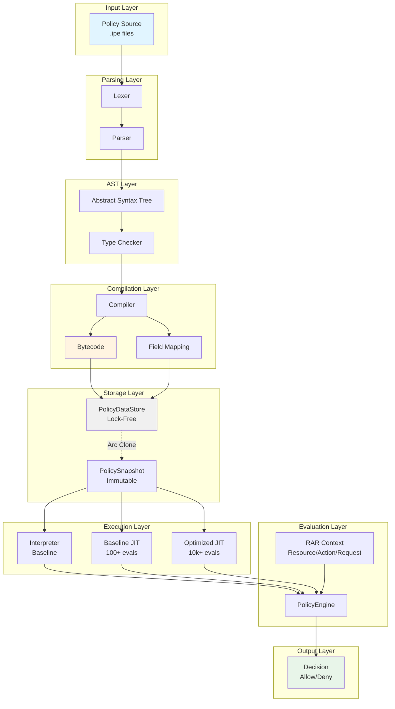

## Component Details

### 1. Lexer & Parser

**Purpose**: Transform policy source code into structured AST

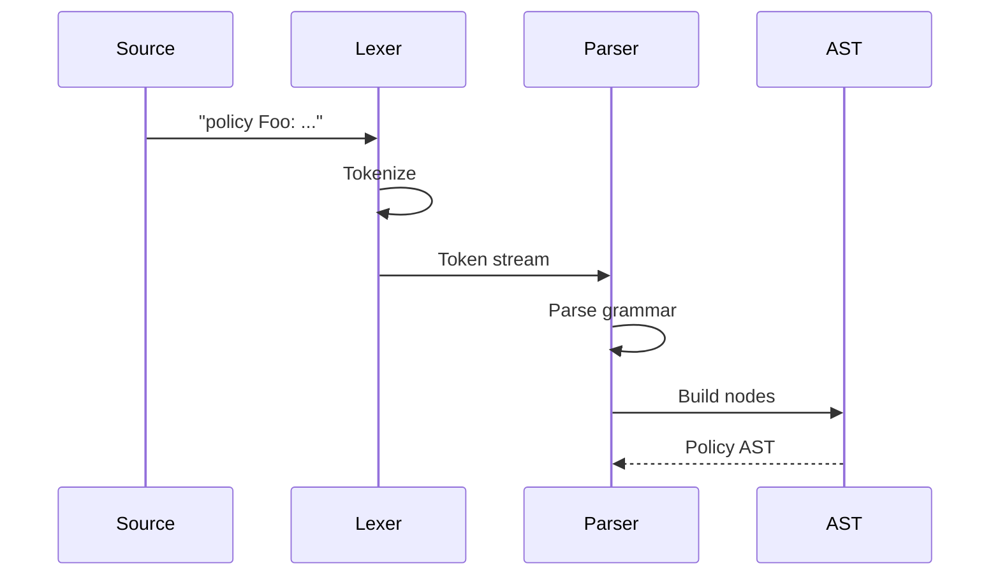

**Key Files**:
- [`crates/ipe-core/src/parser/lexer.rs`](../crates/ipe-core/src/parser/lexer.rs) - Tokenization
- [`crates/ipe-core/src/parser/parse.rs`](../crates/ipe-core/src/parser/parse.rs) - Recursive descent parser
- [`crates/ipe-core/src/parser/token.rs`](../crates/ipe-core/src/parser/token.rs) - Token definitions

**Output**: Abstract Syntax Tree (AST)

---

### 2. AST & Type System

**Purpose**: Provide typed, validated representation of policies

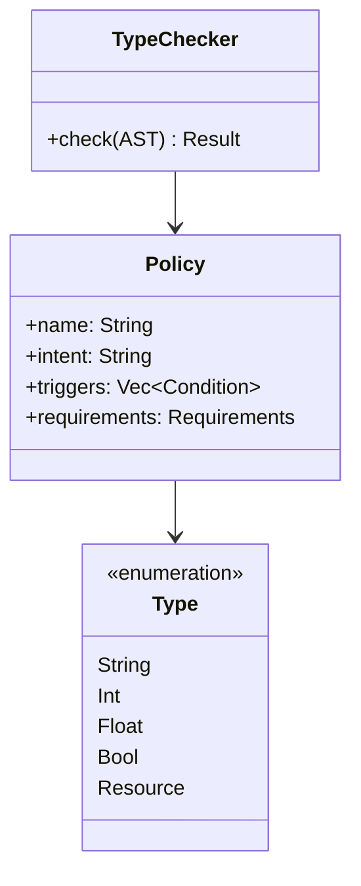

**Key Features**:
- Type inference from literals
- Type compatibility checking
- Int/Float coercion
- Path resolution

**Key Files**:
- [`crates/ipe-core/src/ast/nodes.rs`](../crates/ipe-core/src/ast/nodes.rs) - AST node definitions
- [`crates/ipe-core/src/ast/types.rs`](../crates/ipe-core/src/ast/types.rs) - Type system
- [`crates/ipe-core/src/ast/visitor.rs`](../crates/ipe-core/src/ast/visitor.rs) - Visitor pattern

**Documentation**: [AST Documentation](AST.md)

---

### 3. Bytecode Compiler

**Purpose**: Compile AST to stack-based bytecode

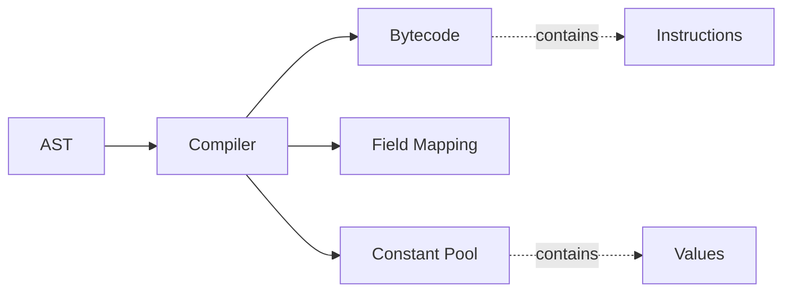

**Optimizations**:
- Constant deduplication
- IN expression expansion to OR chains
- Field offset allocation

**Key Files**:
- [`crates/ipe-core/src/compiler.rs`](../crates/ipe-core/src/compiler.rs) - AST to bytecode compiler
- [`crates/ipe-core/src/bytecode.rs`](../crates/ipe-core/src/bytecode.rs) - Bytecode definitions

**Documentation**: [Bytecode Documentation](BYTECODE.md)

---

### 4. PolicyDataStore (Lock-Free)

**Purpose**: High-performance, concurrent policy storage

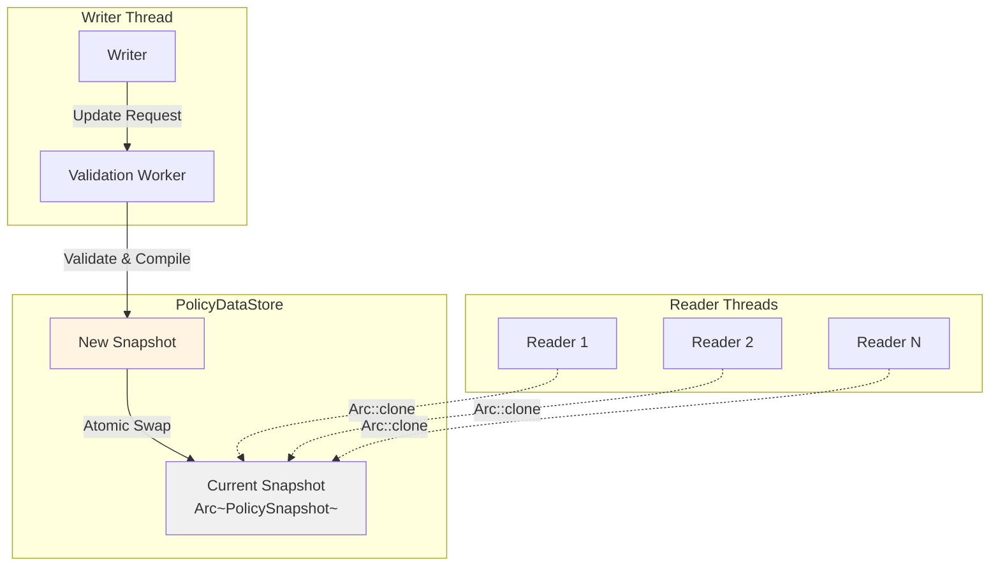

**Key Features**:
- **Lock-free reads**: Arc::clone() with no locking
- **Atomic updates**: Immutable snapshots swapped atomically
- **Background validation**: Worker pool validates policies asynchronously
- **Zero downtime**: Old readers continue with old snapshot

**Performance**:
- Reads: O(1) with Arc clone
- Updates: Asynchronous, non-blocking
- Memory: Copy-on-write (old snapshots dropped when unused)

**Key Files**:
- [`crates/ipe-core/src/store.rs`](../crates/ipe-core/src/store.rs) - Lock-free store implementation
- [`crates/ipe-core/src/index.rs`](../crates/ipe-core/src/index.rs) - Resource type indexing

---

### 5. Execution Tiers

**Purpose**: Adaptive optimization based on policy usage

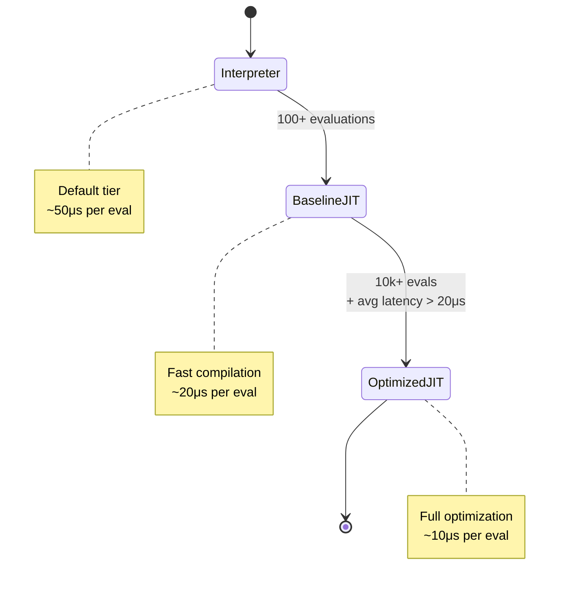

**Promotion Logic**:
```rust
match tier {
    Interpreter => {
        // Promote after 100 evaluations
        count >= 100
    },
    BaselineJIT => {
        // Promote after 10k evals AND high latency
        count >= 10_000 && avg_latency > 20_000
    },
    OptimizedJIT => {
        // Already at top tier
        false
    },
}
```

**Key Files**:
- [`crates/ipe-core/src/tiering.rs`](../crates/ipe-core/src/tiering.rs) - Adaptive tiering
- [`crates/ipe-core/src/jit.rs`](../crates/ipe-core/src/jit.rs) - JIT compiler (Cranelift)

---

### 6. Interpreter

**Purpose**: Execute bytecode policies

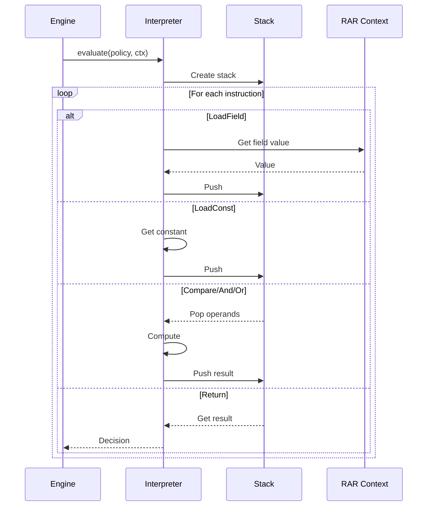

**Stack Operations**:
- **Push**: Add value to stack
- **Pop**: Remove and return top value
- **Peek**: View top without removing
- **Clear**: Reset for next evaluation

**Key Files**:
- [`crates/ipe-core/src/interpreter.rs`](../crates/ipe-core/src/interpreter.rs) - Bytecode interpreter
- [`crates/ipe-core/src/rar.rs`](../crates/ipe-core/src/rar.rs) - Resource/Action/Request context

---

### 7. PolicyEngine (Public API)

**Purpose**: High-level policy evaluation interface

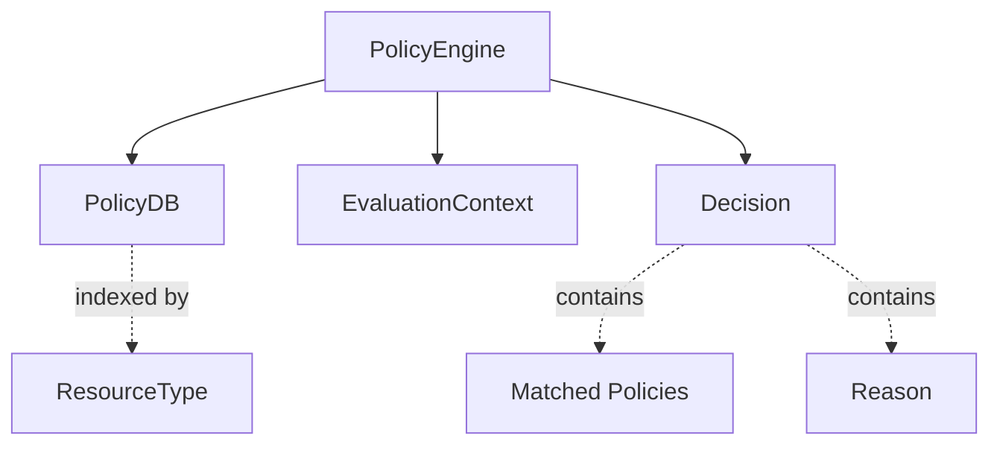

**Decision Resolution**:
1. **No policies**: Default deny
2. **All policies allow**: Allow with matched list
3. **Any policy denies**: Deny (deny overrides allow)
4. **Evaluation errors**: Propagate with policy name context

**Key Files**:
- [`crates/ipe-core/src/engine.rs`](../crates/ipe-core/src/engine.rs) - Public API
- [`crates/ipe-core/src/index.rs`](../crates/ipe-core/src/index.rs) - Policy database

---

## Data Flow

### Policy Compilation

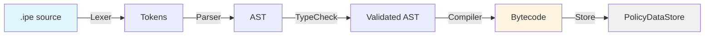

### Policy Evaluation


## Performance Characteristics

| Component | Operation | Time Complexity | Notes |
|-----------|-----------|----------------|-------|
| Lexer | Tokenize | O(n) | n = source length |
| Parser | Parse | O(n) | n = token count |
| TypeChecker | Check | O(nodes) | nodes = AST size |
| Compiler | Compile | O(nodes) | nodes = AST size |
| DataStore | Read | O(1) | Arc clone |
| DataStore | Update | O(m) | m = policy count |
| Interpreter | Evaluate | O(k) | k = instruction count |
| Engine | Query | O(p) | p = matching policies |

**Typical Latencies**:
- Parsing: 100-500μs per policy
- Compilation: 200-800μs per policy
- Evaluation (Interpreter): 10-50μs per policy
- Evaluation (JIT): 5-20μs per policy

## Concurrency Model

### Lock-Free Reads

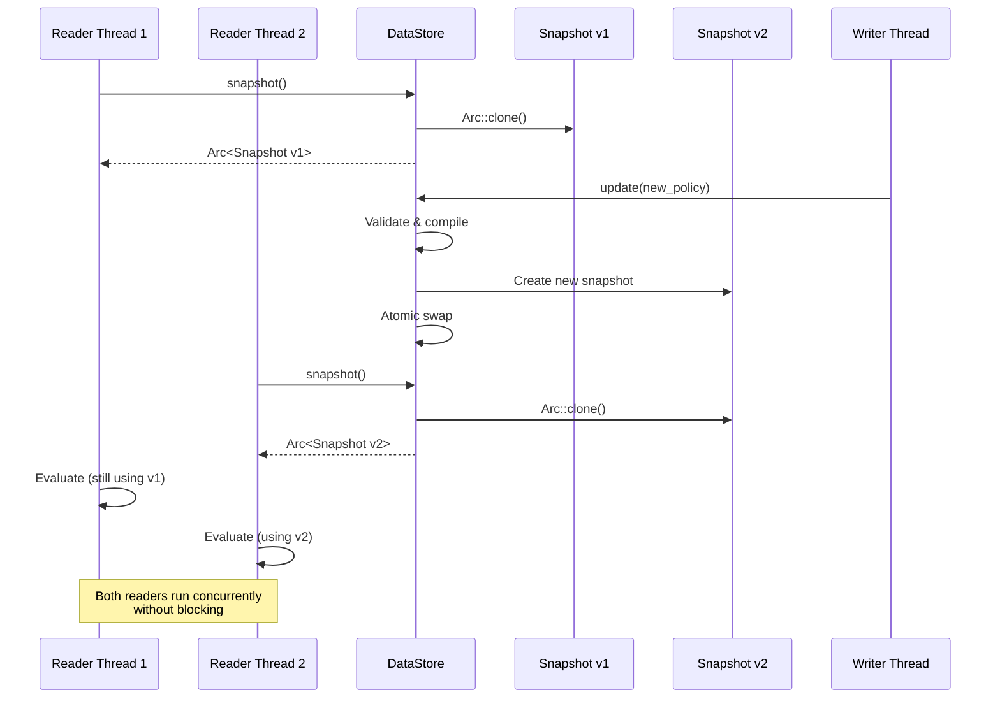

**Key Benefits**:
- No reader/writer locks
- No reader/reader contention
- Writers don't block readers
- Readers see consistent snapshot

### Memory Management

**Reference Counting**:
```rust
Arc<PolicySnapshot> // Atomic reference counted

// When last Arc drops:
//  1. Snapshot memory freed
//  2. Policy bytecode freed
//  3. Constant pools freed
```

**Typical Memory Usage**:
- 1 Policy: ~500 bytes
- 100 Policies: ~50 KB
- 10,000 Policies: ~5 MB
- Snapshot overhead: ~100 bytes

## Testing & Quality

**Test Coverage**: 93.67% (248 tests)

**Test Pyramid**:
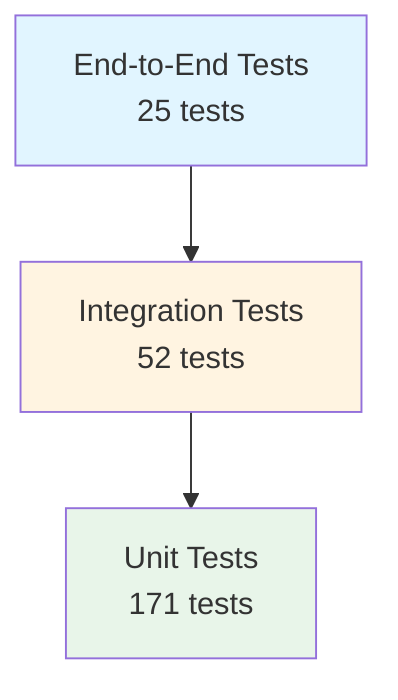

**Key Test Files**:
- [`crates/ipe-core/src/testing.rs`](../crates/ipe-core/src/testing.rs) - Test helpers
- Each module has comprehensive tests in `mod tests`

## Related Documentation

- [AST Documentation](AST.md) - Abstract syntax tree details
- [Bytecode Documentation](BYTECODE.md) - Instruction set and execution
- [README](../README.md) - Project overview and quick start
- [RFC](../RFC.md) - Complete technical specification
