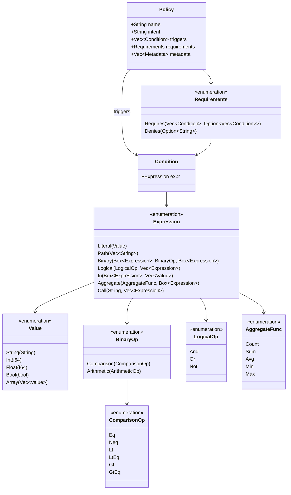
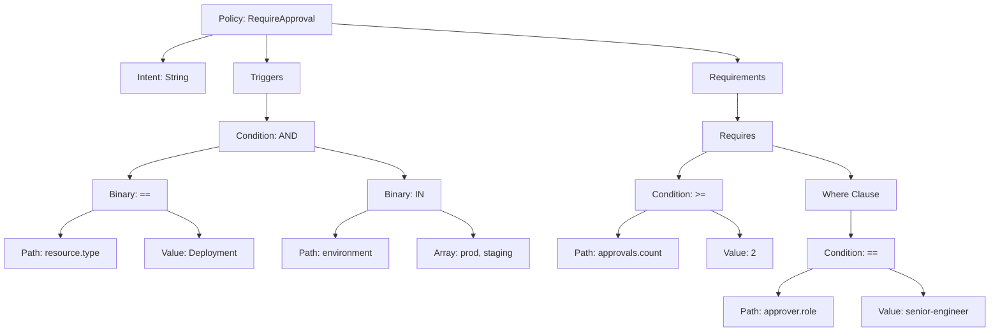
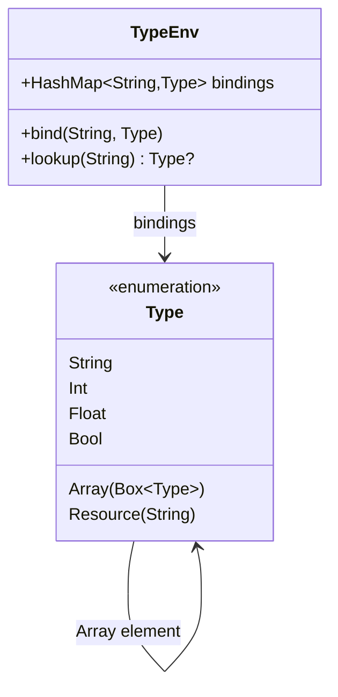
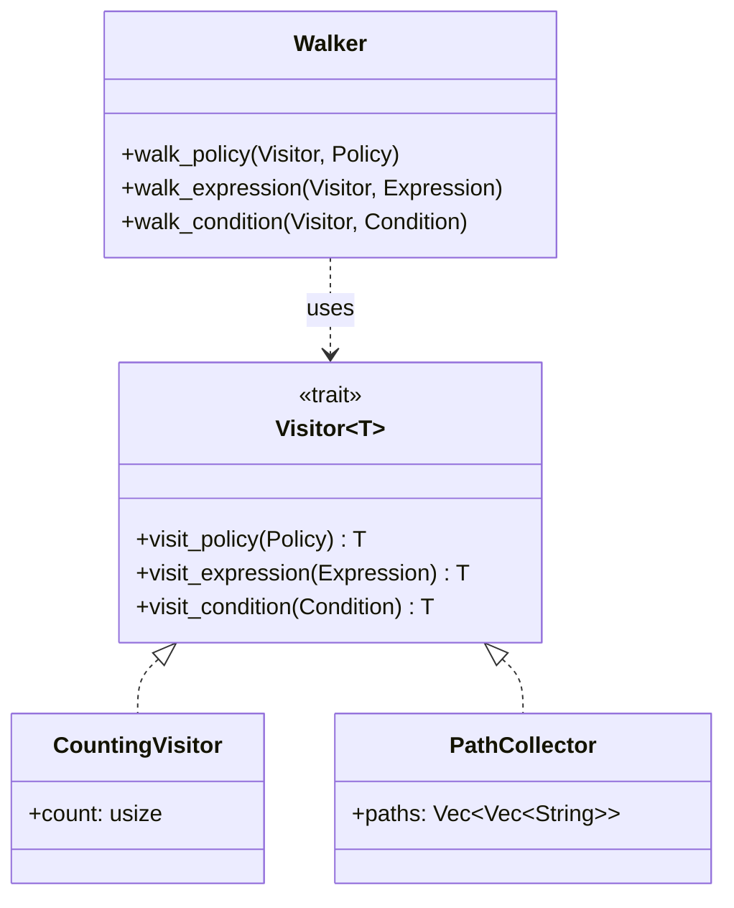

# Abstract Syntax Tree (AST) Documentation

The IPE AST represents the parsed structure of policy definitions. The AST provides a typed, validated representation that can be compiled to bytecode or analyzed for correctness.

## AST Node Structure



## Policy Structure

A policy consists of:
1. **Name**: Unique identifier for the policy
2. **Intent**: Natural language description of policy purpose
3. **Triggers**: Conditions that determine when the policy applies
4. **Requirements**: What must be satisfied (Requires) or denied (Denies)
5. **Metadata**: Optional key-value pairs for additional context

### Example Policy

```rust
policy RequireApproval:
  "Production deployments need 2+ approvals from senior engineers"

  triggers when
    resource.type == "Deployment"
    and environment in ["production", "staging"]

  requires
    approvals.count >= 2
    where approver.role == "senior-engineer"
```

### AST Representation



## Expression Types

### 1. Literal
Direct values embedded in the policy.

```rust
Expression::Literal(Value::Int(42))
Expression::Literal(Value::String("test"))
Expression::Literal(Value::Bool(true))
```

### 2. Path
Field references in RAR (Resource/Action/Request) context.

```rust
Expression::Path(vec!["resource", "type"])
Expression::Path(vec!["request", "principal", "id"])
```

### 3. Binary
Comparison and arithmetic operations.

```rust
Expression::Binary(
    Box::new(Expression::Path(vec!["age"])),
    BinaryOp::Comparison(ComparisonOp::Gt),
    Box::new(Expression::Literal(Value::Int(18)))
)
```

### 4. Logical
Boolean operations (AND, OR, NOT).

```rust
Expression::Logical(
    LogicalOp::And,
    vec![expr1, expr2, expr3]
)
```

### 5. In
Membership testing.

```rust
Expression::In(
    Box::new(Expression::Path(vec!["env"])),
    vec![Value::String("prod"), Value::String("staging")]
)
```

### 6. Aggregate
Collection operations.

```rust
Expression::Aggregate(
    AggregateFunc::Count,
    Box::new(Expression::Path(vec!["items"]))
)
```

### 7. Call
Function invocations.

```rust
Expression::Call(
    "max".to_string(),
    vec![expr1, expr2]
)
```

## Type System



### Type Checking

The type checker ensures:
- Binary operations have compatible operands
- Logical operations work on boolean expressions
- Path expressions resolve to valid fields
- Function calls have correct argument types

### Type Compatibility Rules

| Operation | Left Type | Right Type | Result Type |
|-----------|-----------|------------|-------------|
| `==, !=` | T | T | Bool |
| `<, <=, >, >=` | Int/Float | Int/Float | Bool |
| `and, or` | Bool | Bool | Bool |
| `not` | Bool | - | Bool |
| `in` | T | Array(T) | Bool |

### Int/Float Coercion

The type system allows Int to coerce to Float for comparison operations:
- `5 < 3.14` → Valid (Int coerces to Float)
- `3.14 > 5` → Valid (Int coerces to Float)

## Visitor Pattern

The AST implements the visitor pattern for traversal and analysis.



### Example Visitors

#### CountingVisitor
Counts nodes in the AST:
```rust
let mut visitor = CountingVisitor { count: 0 };
walk_policy(&mut visitor, &policy);
println!("Total nodes: {}", visitor.count);
```

#### PathCollector
Collects all field paths referenced:
```rust
let mut visitor = PathCollector::new();
walk_policy(&mut visitor, &policy);
println!("Paths: {:?}", visitor.paths);
```

## Construction Helpers

The AST provides builder methods for ergonomic construction:

```rust
// Expression builders
Expression::literal(Value::Int(42))
Expression::path(vec!["resource", "type"])
Expression::binary(left, op, right)
Expression::and(vec![expr1, expr2])
Expression::or(vec![expr1, expr2])
Expression::not(operand)
Expression::in_list(expr, values)

// Policy builders
Policy::new(name, intent, triggers, requirements)
Requirements::requires(conditions)
Requirements::requires_where(conditions, where_clause)
Requirements::denies(reason)
```

## Source Location Tracking

Each AST node includes source location information for error reporting:

```rust
pub struct SourceLocation {
    pub line: usize,
    pub column: usize,
    pub file: Option<String>,
}
```

This enables precise error messages:
```
Error at line 12, column 5: Type mismatch in comparison
  resource.count == "five"
                    ^^^^^^ expected Int, found String
```

## Related Documentation

- [Bytecode Documentation](BYTECODE.md) - How AST compiles to bytecode
- [Parser Documentation](../crates/ipe-core/src/parser/) - How text becomes AST
- [Type System](../crates/ipe-core/src/ast/types.rs) - Type checking implementation
