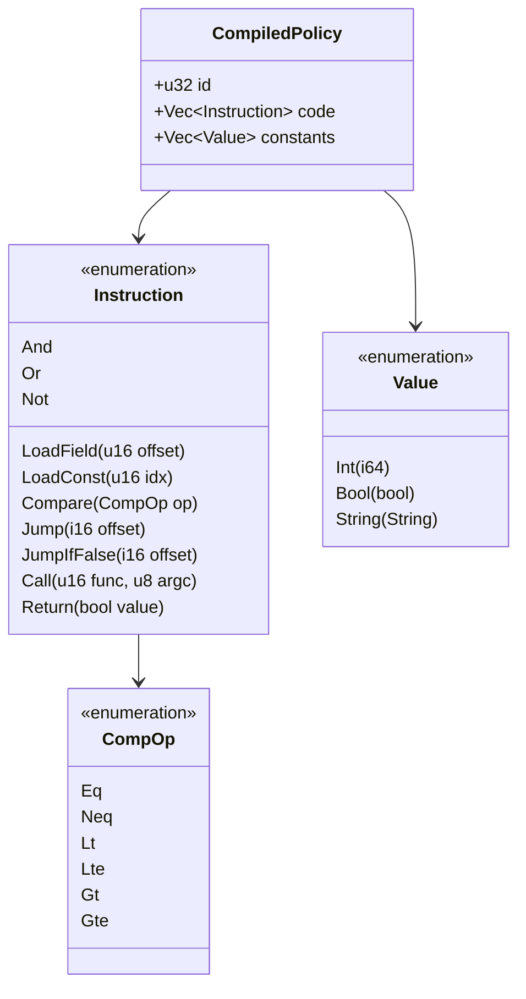
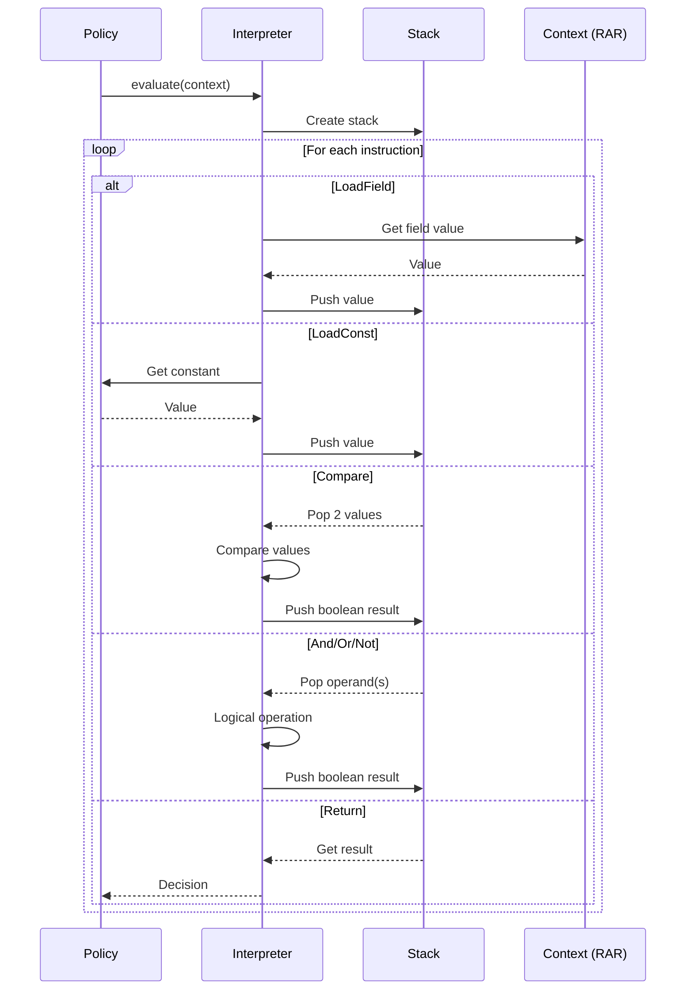
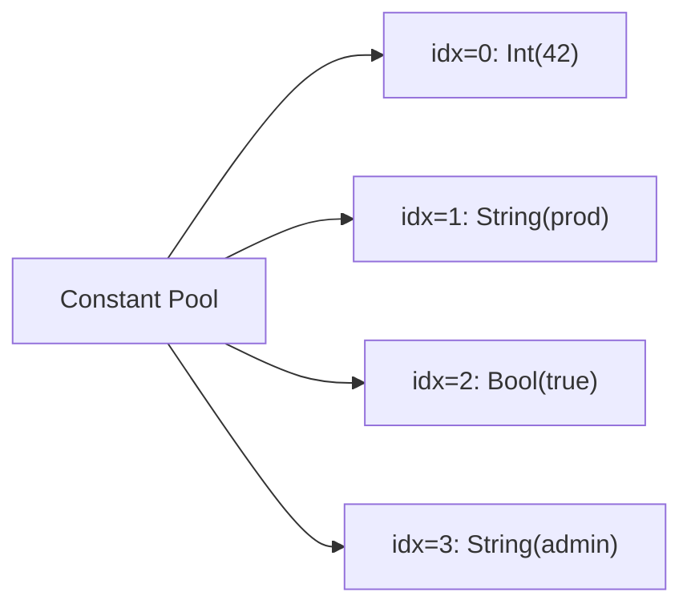
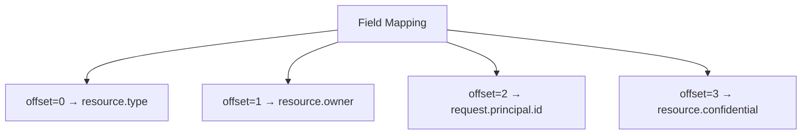
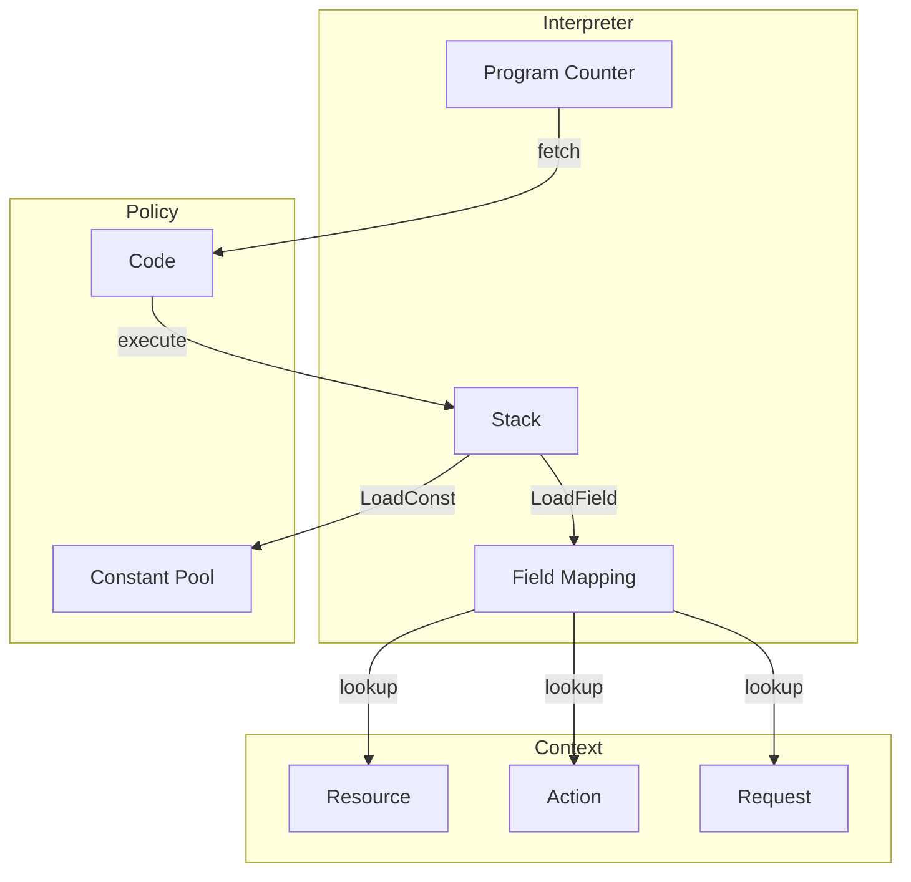
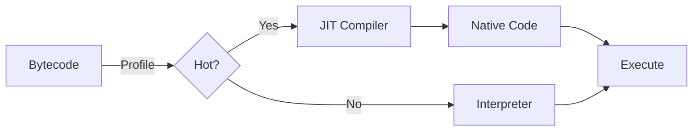

# Bytecode Documentation

The IPE bytecode is a stack-based instruction set optimized for policy evaluation. Policies compile to bytecode for fast interpretation and optional JIT compilation.

## Instruction Set



## Execution Model



## Instruction Details

### 1. LoadField { offset: u16 }

Loads a field from the evaluation context (RAR) onto the stack.

**Behavior**:
- Read field at specified offset from field mapping
- Navigate RAR structure (resource, action, request)
- Push resulting value onto stack

**Example**:
```rust
LoadField { offset: 0 }  // Load resource.type
LoadField { offset: 1 }  // Load resource.owner
```

**Stack Effect**: `[] → [Value]`

---

### 2. LoadConst { idx: u16 }

Loads a constant from the constant pool onto the stack.

**Behavior**:
- Read constant at index from constant pool
- Clone value onto stack

**Example**:
```rust
LoadConst { idx: 0 }  // Load constant "production"
LoadConst { idx: 1 }  // Load constant 42
```

**Stack Effect**: `[] → [Value]`

---

### 3. Compare { op: CompOp }

Compares top two stack values using the specified comparison operator.

**Operators**:
- `Eq`: Equal (==)
- `Neq`: Not equal (!=)
- `Lt`: Less than (<)
- `Lte`: Less than or equal (<=)
- `Gt`: Greater than (>)
- `Gte`: Greater than or equal (>=)

**Behavior**:
- Pop two values from stack (b, then a)
- Compare: a op b
- Push boolean result

**Example**:
```rust
// Evaluate: resource.count >= 5
LoadField { offset: 0 }
LoadConst { idx: 0 }      // 5
Compare { op: CompOp::Gte }
```

**Stack Effect**: `[Value, Value] → [Bool]`

---

### 4. And

Logical AND of top two boolean values.

**Behavior**:
- Pop two booleans from stack
- Compute: a AND b
- Push boolean result

**Example**:
```rust
// Evaluate: is_admin and is_active
LoadField { offset: 0 }   // is_admin
LoadField { offset: 1 }   // is_active
And
```

**Stack Effect**: `[Bool, Bool] → [Bool]`

---

### 5. Or

Logical OR of top two boolean values.

**Behavior**:
- Pop two booleans from stack
- Compute: a OR b
- Push boolean result

**Example**:
```rust
// Evaluate: is_admin or is_owner
LoadField { offset: 0 }   // is_admin
LoadField { offset: 1 }   // is_owner
Or
```

**Stack Effect**: `[Bool, Bool] → [Bool]`

---

### 6. Not

Logical NOT of top boolean value.

**Behavior**:
- Pop boolean from stack
- Compute: NOT a
- Push boolean result

**Example**:
```rust
// Evaluate: not is_suspended
LoadField { offset: 0 }   // is_suspended
Not
```

**Stack Effect**: `[Bool] → [Bool]`

---

### 7. Jump { offset: i16 }

Unconditional jump to relative offset.

**Behavior**:
- Add offset to program counter
- Continue execution at new location

**Example**:
```rust
Jump { offset: 5 }  // Skip next 5 instructions
```

**Stack Effect**: No change

---

### 8. JumpIfFalse { offset: i16 }

Conditional jump if top of stack is false.

**Behavior**:
- Pop boolean from stack
- If false, add offset to program counter
- Otherwise, continue to next instruction

**Example**:
```rust
// Short-circuit AND: if (!a) skip b
LoadField { offset: 0 }    // a
JumpIfFalse { offset: 3 }  // Skip to after b evaluation
LoadField { offset: 1 }    // b
And
```

**Stack Effect**: `[Bool] → []`

---

### 9. Call { func: u16, argc: u8 }

Calls a built-in function.

**Behavior**:
- Pop argc arguments from stack
- Call function with ID func
- Push function result

**Example**:
```rust
// Evaluate: max(a, b)
LoadField { offset: 0 }   // a
LoadField { offset: 1 }   // b
Call { func: 0, argc: 2 } // max function
```

**Stack Effect**: `[Value × argc] → [Value]`

---

### 10. Return { value: bool }

Returns from policy evaluation with result.

**Behavior**:
- Clear stack
- Return boolean decision
- Halt execution

**Example**:
```rust
Return { value: true }   // Allow
Return { value: false }  // Deny
```

**Stack Effect**: `[*] → [] (terminates)`

## Compilation Examples

### Simple Comparison

**Policy**:
```
requires resource.count >= 5
```

**Bytecode**:
```rust
LoadField { offset: 0 }   // resource.count
LoadConst { idx: 0 }      // 5
Compare { op: Gte }
Return { value: true }
```

---

### Logical AND

**Policy**:
```
requires
  resource.type == "Document"
  and resource.confidential == true
```

**Bytecode**:
```rust
// resource.type == "Document"
LoadField { offset: 0 }
LoadConst { idx: 0 }      // "Document"
Compare { op: Eq }

// resource.confidential == true
LoadField { offset: 1 }
LoadConst { idx: 1 }      // true
Compare { op: Eq }

// Combine with AND
And
Return { value: true }
```

---

### IN Expression

**Policy**:
```
requires environment in ["prod", "staging"]
```

**Bytecode** (expanded to OR chain):
```rust
// environment == "prod"
LoadField { offset: 0 }
LoadConst { idx: 0 }      // "prod"
Compare { op: Eq }

// environment == "staging"
LoadField { offset: 0 }
LoadConst { idx: 1 }      // "staging"
Compare { op: Eq }

// Combine with OR
Or
Return { value: true }
```

---

### Short-Circuit AND

**Policy**:
```
requires is_admin and has_permission
```

**Optimized Bytecode** (with short-circuit):
```rust
LoadField { offset: 0 }    // is_admin
JumpIfFalse { offset: 3 }  // Skip if false
LoadField { offset: 1 }    // has_permission
And
Return { value: true }
```

## Constant Pool

The constant pool stores literal values referenced by LoadConst instructions.



### Constant Deduplication

The compiler deduplicates constants to minimize bytecode size:

```rust
// Before deduplication
LoadConst { idx: 0 }  // "admin"
LoadConst { idx: 1 }  // "admin"  (duplicate)

// After deduplication
LoadConst { idx: 0 }  // "admin"
LoadConst { idx: 0 }  // "admin"  (reused)
```

## Field Mapping

Field offsets map to RAR (Resource/Action/Request) paths:



**Example Mapping**:
```rust
HashMap {
    0 => vec!["resource", "type"],
    1 => vec!["resource", "owner"],
    2 => vec!["request", "principal", "id"],
    3 => vec!["resource", "confidential"],
}
```

## Interpreter Architecture



### Stack

- **Type**: Vec<Value>
- **Max Size**: 1024 elements
- **Operations**: push, pop, peek, clear
- **Bounds Checking**: Yes (prevents overflow/underflow)

### Program Counter

- **Type**: usize
- **Range**: 0 to code.len()
- **Bounds Checking**: Yes (prevents out-of-bounds access)

## Performance Characteristics

| Operation | Time Complexity | Notes |
|-----------|----------------|-------|
| LoadField | O(path_depth) | Navigate RAR structure |
| LoadConst | O(1) | Index into constant pool |
| Compare | O(1) | Type-specific comparison |
| And/Or/Not | O(1) | Boolean operations |
| Jump | O(1) | Direct offset |
| Call | O(f) | Function-dependent |
| Return | O(1) | Immediate termination |

### Memory Usage

**Typical Policy**:
- Code: ~50-200 bytes
- Constants: ~20-100 bytes
- Field Mapping: ~50-150 bytes
- **Total**: ~120-450 bytes per policy

**Stack**:
- Size: 8 bytes × stack_depth
- Max: 8 KB (1024 elements)

## Optimization Opportunities

### 1. Constant Folding

```rust
// Before
LoadConst { idx: 0 }  // 5
LoadConst { idx: 1 }  // 3
Compare { op: Lt }    // 5 < 3 = false

// After
LoadConst { idx: 2 }  // false (precomputed)
```

### 2. Dead Code Elimination

```rust
// Before
LoadConst { idx: 0 }  // false
JumpIfFalse { offset: 5 }
...  // Dead code (never executed)
Return { value: true }

// After
Return { value: false }  // Direct return
```

### 3. Peephole Optimization

```rust
// Before
LoadConst { idx: 0 }
Not
Not

// After
LoadConst { idx: 0 }  // Double negation eliminated
```

## JIT Compilation

Bytecode can be JIT-compiled to native code using Cranelift:



**Thresholds**:
- Baseline JIT: 100+ evaluations
- Optimized JIT: 10,000+ evaluations, avg latency > 20μs

**Performance**:
- Interpreter: ~50μs per policy
- Baseline JIT: ~20μs per policy (2-3x faster)
- Optimized JIT: ~10μs per policy (5-10x faster)

## Related Documentation

- [AST Documentation](AST.md) - How policies parse to AST
- [Interpreter](../crates/ipe-core/src/interpreter.rs) - Bytecode interpreter implementation
- [JIT Compiler](../crates/ipe-core/src/jit.rs) - Native code generation
- [Compiler](../crates/ipe-core/src/compiler.rs) - AST to bytecode compilation
