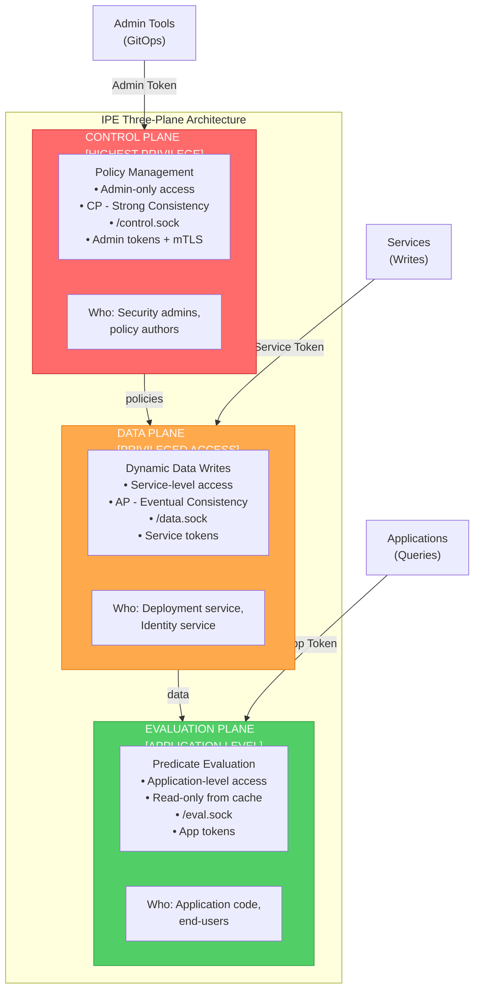
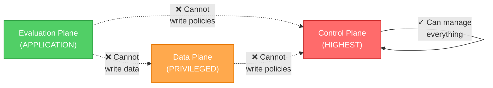
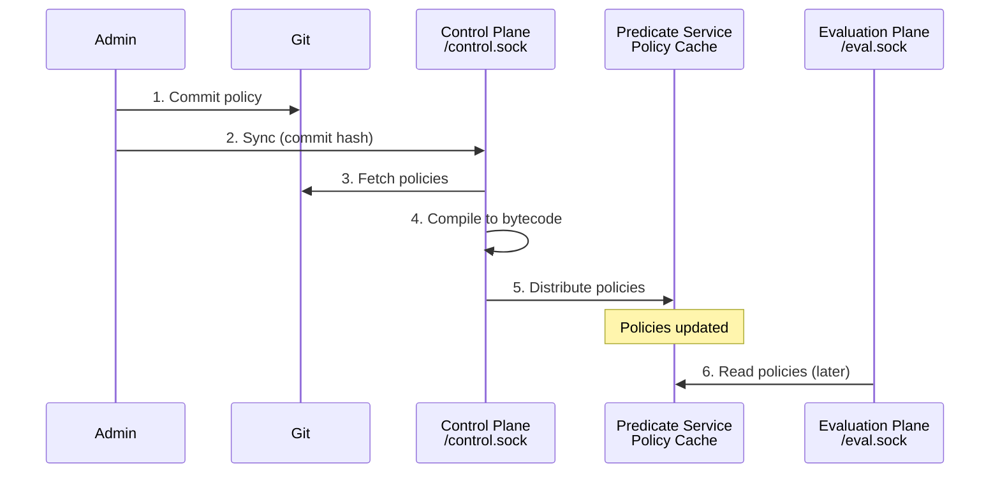
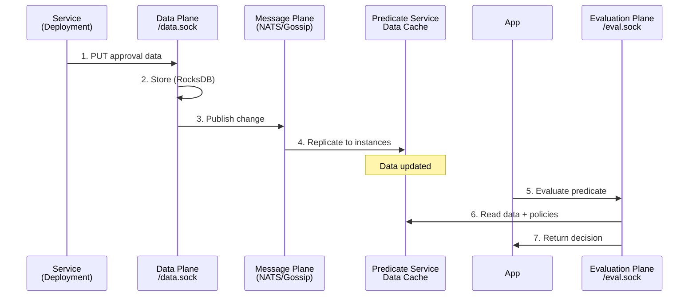
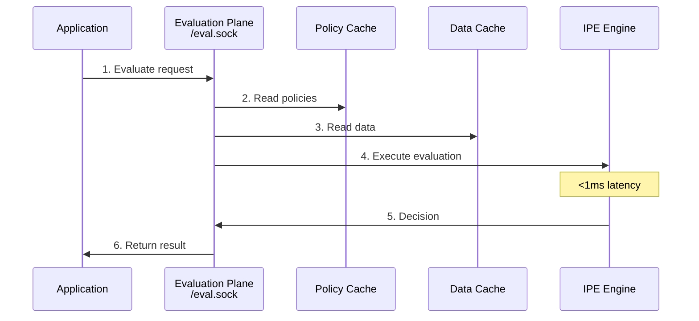

# IPE Privilege Boundaries

**Three-Plane Architecture with Distinct Privilege Levels**

## Overview

IPE separates concerns into three planes, each with different privilege levels, authorization models, and operational semantics:



## Plane Details

### 1. Control Plane (HIGHEST Privilege)

**Purpose:** Policy authoring, management, and distribution

**Operations:**
- `sync` - Sync policies from Git to specific commit
- `list` - List registered predicate service instances
- `stats` - Get detailed instance statistics
- `metadata` - Query policy metadata (Git info)

**Who Can Access:**
- Security administrators
- Policy authors
- CI/CD pipelines (with admin credentials)

**Authorization:**
- Admin-level tokens (long-lived, rotated quarterly)
- mTLS with client certificates
- IP allowlisting for additional security

**Characteristics:**
- Strong consistency (CP) - policies must be correct
- Full audit logging of all operations
- Low write volume (policies change infrequently)
- GitOps-based workflows

**Socket:** `/var/run/ipe/control.sock` (mode 0o660)

---

### 2. Data Plane (PRIVILEGED Access)

**Purpose:** Services write dynamic data that policies evaluate against

**Operations:**
- `put` - Write approval, permission, relationship data
- `delete` - Remove data (tombstone)
- `batch-put` - Write multiple entries
- Data replication via message plane

**Who Can Access:**
- Authorized services only
- Deployment services (write approvals)
- Identity services (write relationships)
- API gateways (write rate limits)

**Authorization:**
- Service-level tokens (per-service credentials)
- Namespace-scoped permissions
  - Example: `deployment-service` can only write `approvals.*`
- Token rotation via service mesh or secrets manager

**Characteristics:**
- Eventual consistency (AP) - availability over consistency
- High write throughput (10K+ writes/sec)
- Message plane distributes to all predicate services
- Services can write during network partitions

**Socket:** `/var/run/ipe/data.sock` (mode 0o660)

**Critical Separation:**
- Data Plane is **write-only** from services
- Predicates read from **local cache** (not via this socket)
- Different authorization than Control Plane
- Logical separation from evaluation queries

---

### 3. Evaluation Plane (APPLICATION Level)

**Purpose:** Applications query predicates for authorization and feature flag decisions

**Operations:**
- `evaluate` - Evaluate one or more policies
- `subscribe` - Subscribe to policy changes (optional)
- Query feature flags
- Read-only access to policy tree

**Who Can Access:**
- Application code
- End-user requests (via application)
- Services making authorization decisions

**Authorization:**
- Application-level tokens (short-lived)
- Rate limiting per token
- Optional: per-endpoint quotas

**Characteristics:**
- Read-only from local cache
- Sub-millisecond latency (<1ms p99)
- High query volume (10K+ queries/sec)
- No writes allowed

**Socket:** `/var/run/ipe/eval.sock` (mode 0o666)

## Privilege Escalation Prevention



**Enforcement:**
1. **Socket Separation** - Each plane has its own Unix socket
2. **Different Auth Tokens** - Token type determines allowed operations
3. **File Permissions** - Socket file modes restrict access
4. **Namespace Scoping** - Data plane auth is per-namespace
5. **API Validation** - Requests validated against token type

## Data Flow

### Policy Distribution (Control Plane → Predicate Services)



### Dynamic Data Flow (Services → Data Plane → Predicates)



### Evaluation Flow (Applications → Evaluation Plane)



## Token Types

### Admin Token
- **Issued To:** Security administrators
- **Allows:** All control plane operations
- **Lifetime:** 90 days (rotated)
- **Format:** `ipe_admin_<random>`

### Service Token
- **Issued To:** Services (deployment, identity, etc.)
- **Allows:** Data plane writes for specific namespaces
- **Lifetime:** 30 days (auto-rotated)
- **Format:** `ipe_service_<service-name>_<random>`
- **Scoped To:** Namespace patterns (e.g., `approvals.*`)

### Application Token
- **Issued To:** Applications
- **Allows:** Evaluation plane queries only
- **Lifetime:** 24 hours (short-lived)
- **Format:** `ipe_app_<app-name>_<random>`
- **Rate Limited:** 1000 requests/minute

## Security Considerations

### Why Three Planes?

1. **Separation of Concerns**
   - Policy management (rare, admin-only)
   - Data writes (frequent, service-level)
   - Evaluation queries (very frequent, application-level)

2. **Blast Radius Limitation**
   - Compromised app token → can only query predicates
   - Compromised service token → can only write data in allowed namespaces
   - Compromised admin token → requires immediate rotation

3. **Audit Granularity**
   - Control Plane: Full audit (every operation logged)
   - Data Plane: Sampled audit (high volume)
   - Evaluation Plane: Minimal audit (query logging optional)

4. **Performance Isolation**
   - High-volume data writes don't affect policy distribution
   - High-volume evaluations don't affect policy or data writes
   - Each plane can scale independently

### Threat Model

| Threat | Control Plane | Data Plane | Evaluation Plane |
|--------|---------------|------------|------------------|
| **Policy Tampering** | ✓ Protected by admin auth | ✗ Cannot access | ✗ Cannot access |
| **Data Poisoning** | ✗ Cannot write data | ✓ Protected by service auth + namespaces | ✗ Cannot write |
| **Query DoS** | ✗ Separate socket | ✗ Separate socket | ✓ Rate limited |
| **Privilege Escalation** | ✗ Token type enforced | ✗ Token type enforced | ✗ Token type enforced |

## Example Scenarios

### Scenario 1: Deployment Approval

```
1. User Alice clicks "Approve Deployment" in UI
2. Deployment service writes approval:
   POST /data.sock (Service Token: deployment-service)
   {
     "method": "put",
     "params": {
       "key": "approvals.deploy-123",
       "value": {"user": "alice", "role": "senior_engineer"}
     }
   }

3. Application evaluates deployment policy:
   POST /eval.sock (App Token: deployment-app)
   {
     "method": "evaluate",
     "params": {
       "policies": ["prod.deployment.approval"],
       "context": {"deployment_id": "deploy-123"}
     }
   }

4. Predicate reads approvals from local cache, evaluates, returns decision
```

**Key Points:**
- Deployment service uses **service token** (Data Plane)
- Application uses **app token** (Evaluation Plane)
- No privilege escalation possible

### Scenario 2: Policy Update

```
1. Admin commits new policy to Git
2. Admin triggers sync:
   POST /control.sock (Admin Token)
   {
     "method": "sync",
     "params": {"commit": "abc123"}
   }

3. Control plane fetches from Git, compiles, distributes
4. Predicate services update local cache
5. Future evaluations use new policy automatically
```

**Key Points:**
- Only admin token can sync policies
- Service tokens cannot modify policies
- App tokens cannot modify policies

## Implementation Notes

### Socket Permissions

```bash
# Control Plane - restricted to admin group
/var/run/ipe/control.sock (0o660, owned by ipe:ipe-admin)

# Data Plane - restricted to services group
/var/run/ipe/data.sock (0o660, owned by ipe:ipe-services)

# Evaluation Plane - world-readable (auth via tokens)
/var/run/ipe/eval.sock (0o666, owned by ipe:ipe)
```

### Token Storage

- Admin tokens: HSM or admin secrets manager
- Service tokens: Kubernetes secrets, Vault
- App tokens: Generated per-request or cached briefly

## References

- [RFC-001: Predicate Service Architecture](001-predicate-service-architecture.md)
- [RFC-002: SSE/JSON Protocol](002-sse-json-protocol.md)
- [RFC-004: Control Plane Architecture](004-control-plane.md)
- [RFC-005: Data Plane Architecture](005-data-plane.md)
